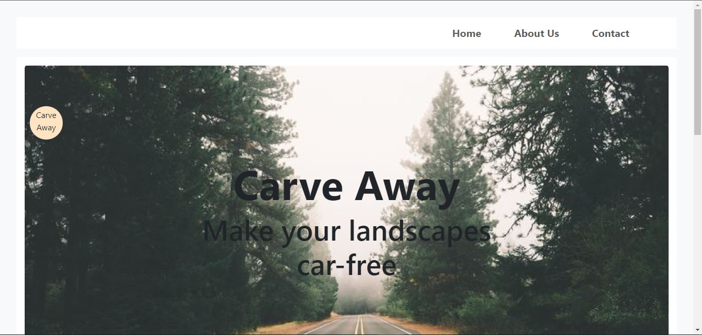

# Car Detection

> This is a website for Car Detection & Remove.  



## Frontend
### Install
Open your terminal in this project folder.
```
npm install
```
### Preview
Once npm packages are installed, then run this script to preview.
```
npm run dev
```

## Backend & Model

Please provide me with backend & model asap.  

My `Skype` Address: `live:.cid.9d6e57af4c90cd35`  
Let contact with Skype.  

`BestarDev`